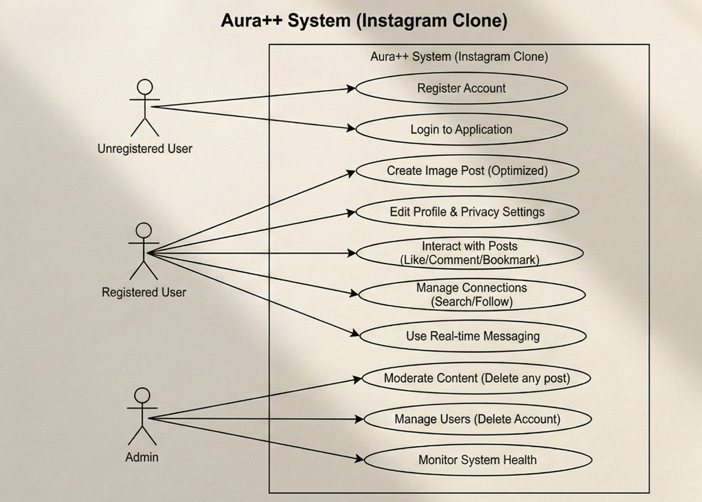
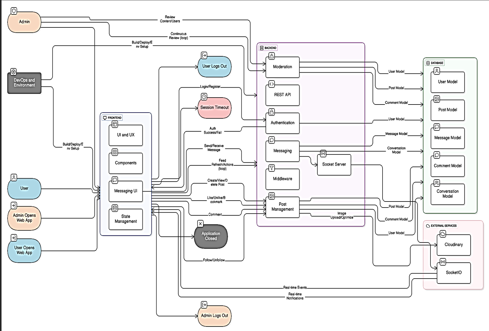
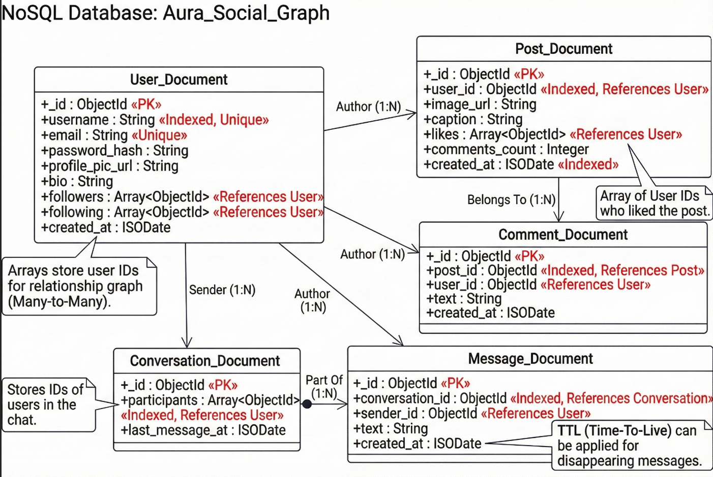

# 🌟 Aura - Instagram Clone

[](https://reactjs.org/)
[](https://nodejs.org/)
[](https://mongodb.com/)
[](https://socket.io/)
[](LICENSE)

**Aura** is a full-featured Instagram clone built with modern web technologies. Experience social media like never before with real-time messaging, photo sharing, and seamless user interactions.


## ✨ Features

### 🔐 Authentication & Security
- **JWT Authentication** - Secure user login/registration
- **Password Encryption** - bcrypt hashing for secure storage
- **Cookie-based Sessions** - HTTP-only cookies for enhanced security
- **Protected Routes** - Role-based access control

### 📸 Post Management
- **Image Upload** - Cloudinary integration for image storage
- **Image Optimization** - Sharp.js for automatic resizing and compression
- **Create Posts** - Upload photos with captions
- **Delete Posts** - Remove your own posts (with admin override)
- **View Posts** - Instagram-like feed with infinite scroll

### 💖 Social Interactions
- **Like/Unlike Posts** - Heart button functionality with duplicate prevention
- **Comments System** - Add, view, and manage comments
- **Bookmark Posts** - Save posts for later viewing
- **Follow/Unfollow** - Build your social network
- **User Search** - Find users with real-time search

### 💬 Real-time Messaging
- **Direct Messages** - Instagram-like chat interface
- **Real-time Delivery** - Socket.IO powered instant messaging
- **Online Status** - See who's online
- **Message Notifications** - Live notification system
- **Conversation Management** - Organized chat threads

### 👤 User Profiles
- **Profile Customization** - Edit bio, profile picture, and privacy settings
- **Private Accounts** - Control who can see your content
- **Followers/Following Lists** - View social connections
- **User Posts Grid** - See all posts from any user

### 🔧 Admin Features
- **User Management** - Admin can remove users with complete data cleanup
- **Content Moderation** - Comment filtering for inappropriate content
- **System Monitoring** - Comprehensive error handling and logging

## 🛠️ Tech Stack

### Backend
- **Node.js** - Runtime environment
- **Express.js** - Web application framework
- **MongoDB** - NoSQL database with Mongoose ODM
- **Socket.IO** - Real-time bidirectional communication
- **Cloudinary** - Cloud-based image management
- **JWT** - JSON Web Tokens for authentication
- **bcryptjs** - Password hashing
- **Multer** - File upload middleware
- **Sharp** - Image processing

### Frontend
- **React 19** - User interface library
- **Redux Toolkit** - State management
- **Tailwind CSS** - Utility-first CSS framework
- **Radix UI** - Accessible component primitives
- **Axios** - HTTP client
- **Lucide React** - Icon library
- **Vite** - Build tool and development server

## 🚀 Quick Start

### Prerequisites
- Node.js 20+ installed
- MongoDB database (local or cloud)
- Cloudinary account for image storage

### Installation

1. **Clone the repository**
```bash
git clone https://github.com/sparshsharma81/Aura.git
cd Aura
```

2. **Install dependencies**
```bash
# Install all dependencies (backend + frontend)
npm run build
```

3. **Environment Setup**

Create `.env` file in the backend directory:
```env
PORT=5000
MONGO_URI=your_mongodb_connection_string
SECRET_KEY=your_jwt_secret_key
CLOUDINARY_CLOUD_NAME=your_cloudinary_cloud_name
CLOUDINARY_API_KEY=your_cloudinary_api_key
CLOUDINARY_API_SECRET=your_cloudinary_api_secret
SPECIAL_USER_ID=admin_user_id_here
NODE_ENV=development
```

4. **Start the application**
```bash
# Development mode
npm run dev

# Production mode
npm start
```

The app will be available at `http://localhost:5000`

## 📁 Project Structure

```
Aura/
├── backend/
│   ├── controllers/          # Business logic
│   │   ├── user.controller.js
│   │   ├── post.controller.js
│   │   └── message.controller.js
│   ├── models/              # Database schemas
│   │   ├── user.model.js
│   │   ├── post.model.js
│   │   ├── comment.model.js
│   │   ├── message.model.js
│   │   └── conversation.model.js
│   ├── routes/              # API endpoints
│   │   ├── user.route.js
│   │   ├── post.route.js
│   │   └── message.route.js
│   ├── middlewares/         # Custom middleware
│   │   ├── isAuthenticated.js
│   │   ├── multer.js
│   │   └── isBlueTick.js
│   ├── utils/               # Utility functions
│   │   ├── db.js
│   │   ├── cloudinary.js
│   │   └── datauri.js
│   ├── socket/              # Real-time functionality
│   │   └── socket.js
│   └── index.js             # Server entry point
├── frontend/
│   ├── src/
│   │   ├── components/      # React components
│   │   │   ├── ui/          # Reusable UI components
│   │   │   ├── Home.jsx
│   │   │   ├── Profile.jsx
│   │   │   ├── Messages.jsx
│   │   │   └── ...
│   │   ├── redux/           # State management
│   │   │   ├── store.js
│   │   │   ├── authSlice.js
│   │   │   ├── postSlice.js
│   │   │   └── chatSlice.js
│   │   ├── hooks/           # Custom React hooks
│   │   ├── lib/            # Utility functions
│   │   └── main.jsx        # App entry point
│   ├── public/             # Static assets
│   └── package.json
└── README.md
```

## 🔌 API Endpoints

### Authentication
- `POST /api/v1/user/register` - User registration
- `POST /api/v1/user/login` - User login
- `GET /api/v1/user/logout` - User logout

### User Management
- `GET /api/v1/user/:id/profile` - Get user profile
- `POST /api/v1/user/profile/edit` - Edit profile
- `GET /api/v1/user/suggested` - Get suggested users
- `GET /api/v1/user/search?query=username` - Search users
- `POST /api/v1/user/follow/:id` - Follow/unfollow user

### Posts
- `POST /api/v1/post/addpost` - Create new post
- `GET /api/v1/post/all` - Get all posts (feed)
- `GET /api/v1/post/userpost/all` - Get user's posts
- `GET /api/v1/post/:id/like` - Like post
- `GET /api/v1/post/:id/dislike` - Unlike post
- `POST /api/v1/post/:id/comment` - Add comment
- `DELETE /api/v1/post/delete/:id` - Delete post
- `GET /api/v1/post/:id/bookmark` - Bookmark post

### Messages
- `POST /api/v1/message/send/:id` - Send message
- `GET /api/v1/message/:id` - Get conversation messages

## 🎨 UI Components

### Core Components
- **MainLayout** - App shell with navigation
- **LeftSideBar** - Navigation menu
- **RightSideBar** - Suggestions and activity
- **Feed** - Main content area
- **Post** - Individual post component
- **CreatePost** - Post creation modal
- **Profile** - User profile page
- **Messages** - Chat interface
- **SearchBox** - User search functionality

### UI Library
- Radix UI components for accessibility
- Custom styled components with Tailwind CSS
- Responsive design for all screen sizes

## 🔄 Real-time Features

### Socket.IO Events
- `newMessage` - New chat message received
- `messageNotification` - Message notification
- `notification` - General notifications (likes, follows, comments)
- `user-online` - User online status
- `user-offline` - User offline status

## 🧪 Development

### Running in Development Mode
```bash
# Start backend server (with nodemon)
npm run dev

# Start frontend dev server
cd frontend && npm run dev
```

### Building for Production
```bash
# Build frontend and start production server
npm run build
npm start
```

## 🔒 Security Features

- **JWT Authentication** with HTTP-only cookies
- **Password hashing** with bcrypt (10 rounds)
- **CORS configuration** for cross-origin requests
- **Input validation** and sanitization
- **File upload restrictions** (images only)
- **Rate limiting** considerations
- **XSS protection** with secure headers

## 🗄️ Database Schema

### User Model
- Personal information (username, email, bio)
- Social connections (followers, following)
- Content references (posts, bookmarks)
- Privacy settings (isPrivate)

### Post Model
- Content (image, caption)
- Engagement (likes, comments)
- Metadata (author, timestamp)

### Message/Conversation Models
- Real-time chat system
- Participant management
- Message history


# Class Diagram

<p align="center">
  
</p>


# Context Diagram

<p align="center">
  
</p>

# Database design

<p align="center">
  
</p>

# Backend Service Diagram

<p align="center">
  
</p>


 
## 🤝 Contributing

1. Fork the repository
2. Create your feature branch (`git checkout -b feature/AmazingFeature`)
3. Commit your changes (`git commit -m 'Add some AmazingFeature'`)
4. Push to the branch (`git push origin feature/AmazingFeature`)
5. Open a Pull Request

## 📝 License

This project is licensed under the MIT License - see the [LICENSE](LICENSE) file for details.

## 🙏 Acknowledgments

- **Cloudinary** for image storage and optimization
- **MongoDB** for flexible data storage
- **Socket.IO** for real-time communication
- **Radix UI** for accessible components
- **Tailwind CSS** for rapid styling

## 📞 Contact

**Sparsh Sharma** - [@sparshsharma81](https://github.com/sparshsharma81)

Project Link: [https://github.com/sparshsharma81/Aura](https://github.com/sparshsharma81/Aura)

---

<div align="center">
  <b>⭐ Star this repository if you found it helpful! ⭐</b>

</div>
=======
</div>
